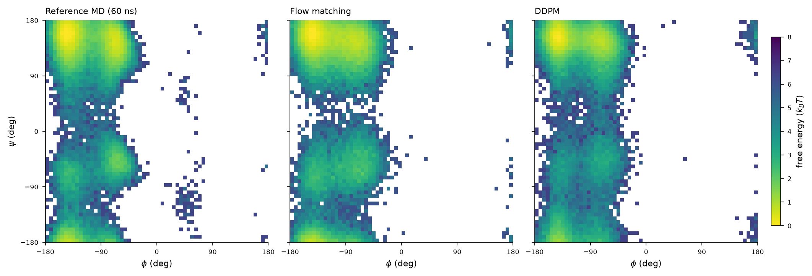
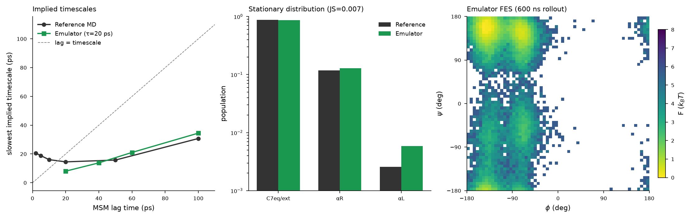

# Learned Boltzmann Sampler for Alanine Dipeptide

A generative model that samples the equilibrium conformational ensemble of **alanine dipeptide**
(ACE-ALA-NME, 22 atoms, Amber ff14SB + implicit solvent, 300 K) **without integrating the equations
of motion** — then validates it against a reference MD trajectory. A continuous-time **flow-matching**
model is the core deliverable, with a **DDPM** baseline for head-to-head comparison, plus a stretch-goal
**dynamics emulator** that takes 20-ps timesteps and is validated with a Markov State Model.

Both generative models **pass all acceptance criteria** (FES MAE < 1 kT over populated bins,
basin free energies within 1 kT, > 95 % physically valid structures).



## Results at a glance

| Metric (target) | Flow matching | DDPM |
|---|---|---|
| Ramachandran FES MAE, populated bins (≤ 1 kT) | **0.47 kT** ✅ | **0.59 kT** ✅ |
| Basin ΔΔG vs reference, αR (within 1 kT) | -0.08 kT ✅ | +0.32 kT ✅ |
| Physically valid structures (≥ 95 %) | **98.1 %** ✅ | **98.4 %** ✅ |
| Dihedral W₁(φ) / W₁(ψ) [rad] | 0.061 / 0.024 | 0.041 / 0.087 |
| Bond / angle W₁ | 9.8e-05 Å / 5.7e-04 rad | 1.3e-04 Å / 7.4e-04 rad |

Full numbers in [`report/metrics.json`](report/metrics.json); narrative pass/fail in
[`report/report.md`](report/report.md).

## Method

1. **Reference MD** — OpenMM, `AlanineDipeptideImplicit`, LangevinMiddle integrator, 2 fs + HMR, 300 K.
   3 independent seeds × 20 ns = **60 ns aggregate** (60,000 frames, 1 ps spacing).
   Convergence verified by block-averaged basin populations across seeds
   (ΔG(αR) reproducible to 0.105 kT).
2. **Representation** — BAT internal coordinates (60 DOF = 3N−6). Torsions are cos/sin-encoded to
   respect periodicity; bonds/angles are standardized on training statistics → **79-dim vector**.
   Cartesian↔internal round-trip is exact to < 1e-14 rad ([`roundtrip_test.png`](figures/roundtrip_test.png)).
   Train = seeds 1–2, held-out test = seed 3.
3. **Generative models** — both a residual MLP (hidden 256, 4 blocks) with sinusoidal time embedding + EMA:
   - **Flow matching** — independent-coupling OT-CFM, linear interpolant; sampled with a Heun probability-flow ODE.
   - **DDPM** — cosine β schedule, ε-prediction; ancestral sampling with x0-clamping.
4. **Validation** — Ramachandran FES MAE, circular Wasserstein-1 / Jensen–Shannon on φ and ψ,
   basin populations & relative free energies, local-geometry histograms, and OpenMM force-field
   energy validity.
5. **Dynamics emulator (stretch)** — a *conditional* flow-matching propagator p(x_{t+τ} | x_t) at
   **τ = 20 ps**, rolled out to 600 ns and analyzed with a
   50-state MSM (deeptime). The emulator's stationary distribution matches reference
   (**JS = 0.007**); implied timescales are the right order of magnitude
   (slowest ~8 ps vs reference ~15 ps,
   converging at longer lag). Honest partial success on kinetics.

## Repository layout

```
alanine-dipeptide-boltzmann-sampler/
├── config.yaml              # every hyperparameter + pinned library versions
├── requirements.txt
├── src/
│   ├── run_md.py            # reference MD generation (python run_md.py <seed> <ns> <outdir>)
│   ├── featurizer.py        # BAT Z-matrix: Cartesian <-> internal <-> encoded
│   ├── models.py            # ResMLP, EMA, OT-CFM + DDPM losses/samplers, trainer
│   ├── train_driver.py      # standalone trainer:  python train_driver.py fm|ddpm
│   └── propagator_model.py  # conditional propagator for the dynamics emulator
├── checkpoints/             # fm.pt, ddpm.pt, propagator.pt (all with EMA weights) + loss curves
├── figures/                 # all comparison figures (PNG)
├── report/                  # report.md (pass/fail) + metrics.json (all numbers)
└── data/
    ├── md/                  # topology.pdb + seed{1,2,3}.dcd  (reference trajectory)
    ├── convergence.json     # per-seed basin populations + block averages
    ├── split_manifest.json  # Z-matrix order, phi/psi atoms, train/test basin counts
    ├── phipsi.npz           # per-seed phi/psi (radians)
    └── reference_fes.npz     # reference free-energy surface (F, phi-edges, psi-edges)
```

## Reproducing

```bash
conda create -n ala2 -c conda-forge python=3.11 openmm openmmtools mdtraj \
    pytorch deeptime pyyaml scipy matplotlib pot
conda activate ala2

# 1. Reference MD (3 seeds, ~22 min each on 1 CPU thread; run in parallel)
for s in 1 2 3; do python src/run_md.py $s 20 data/md & done; wait

# 2. Featurize + train (encoded.npz is regenerated by the featurizer; see src/featurizer.py)
python src/train_driver.py fm
python src/train_driver.py ddpm
```

The large intermediate arrays (`encoded.npz`, `samples*.npz`, `energies.npz`) are **not committed** —
they are regenerated by the pipeline. The reference DCD trajectories, trained checkpoints, figures,
and all metrics **are** included so the results are inspectable without rerunning anything.

## Key design notes

- **Periodicity matters.** Torsions are encoded as (cos θ, sin θ) and decoded with atan2 — treating them
  as Euclidean introduces wrap-around artifacts at ±180°. All dihedral divergences are computed *on the circle*.
- **DDPM sampler.** The cosine schedule drives ᾱ→0 at the final timesteps, which breaks naive DDIM
  (division by ~0). Ancestral sampling with x0-clamping is the numerically stable baseline used here;
  this is documented in `report.md` and `metrics.json`.
- **Basin populations are the sharpest test.** A model can produce a plausible-looking Ramachandran plot
  yet get relative free energies wrong; both models here are within ~0.3 kT of reference.

## Stretch goal — dynamics emulator



Left: implied timescales track the reference and converge together at longer MSM lag.
Middle: emulator stationary populations match reference (JS = 0.007).
Right: the 600 ns emulated Ramachandran surface reproduces the metastable basins.

## License

MIT — see [`LICENSE`](LICENSE).
